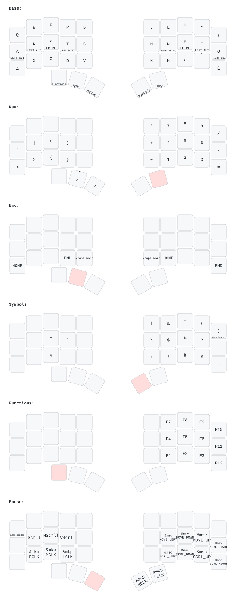

ZMK config for the Charybdis Nano on a Canadian Multilingual Standard system

Keymap is edited using [Nick Coutsos' keymap-editor](https://nickcoutsos.github.io/keymap-editor/)

Layout is drawn using [Cem Aksoylar's keymap-drawer](https://github.com/caksoylar/keymap-drawer):

